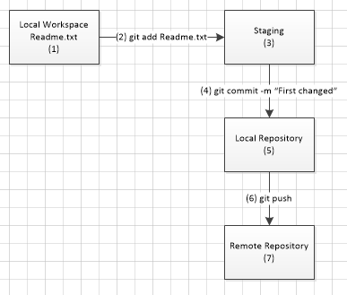

# My Git tutorial
<h3>Basic working principles</h3>

(1) The user edit and save Readme.txt file.
    You can check the state using:
    > git status    (the file is diplayed as "Untrack")

(2) Now we need do send to staging (a packaging procedure for future commit)
    > git add Readme.txt
    
(3) The file is now is Staging.

(4) To save to Loca repository use:
    > git commit -m "Any comment"
    
(5) The file is now saved in your local repostitory

(6) To update the Remote Repository, use:
    > git push
    
(7) Now your remote repository is updated.
    You can check it out in your git hub account (https://github.com/yourUserName)
    
That's all.

<strong>Basic commands</strong>

<ul>
   <li>Initializing a local repository</li>
   <li>Query commands</li>
      > git branch            : show all branches
</ul>

<h4> How to generate as ssh key:</h4>
 > ssh-keygen -t rsa -b 4096 -C "seu.email@email.com"
 
 For windows users, we can find the generated key in:
    c:\users\myUserName\.ssh\id_rsa.pub
    
 Now we will be able to set up our github account and the system will never ask again for username
 and password each time we need push our changes.

